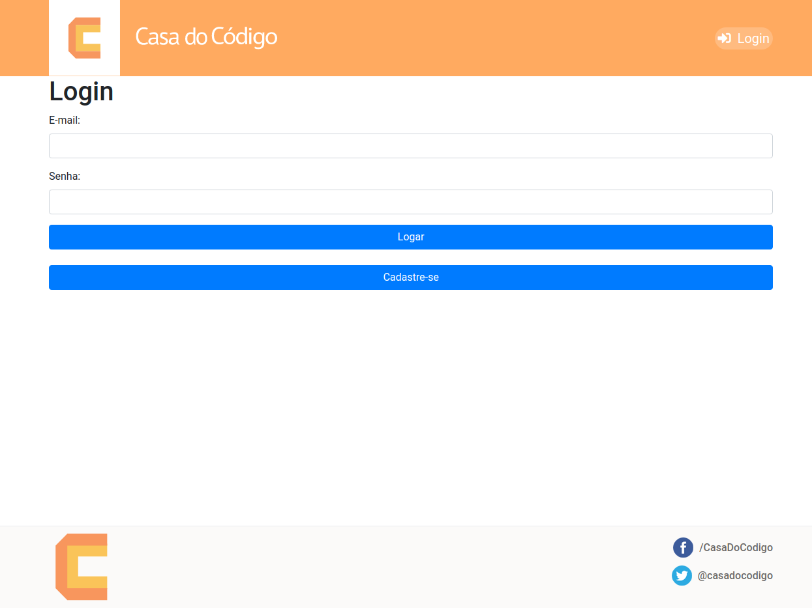
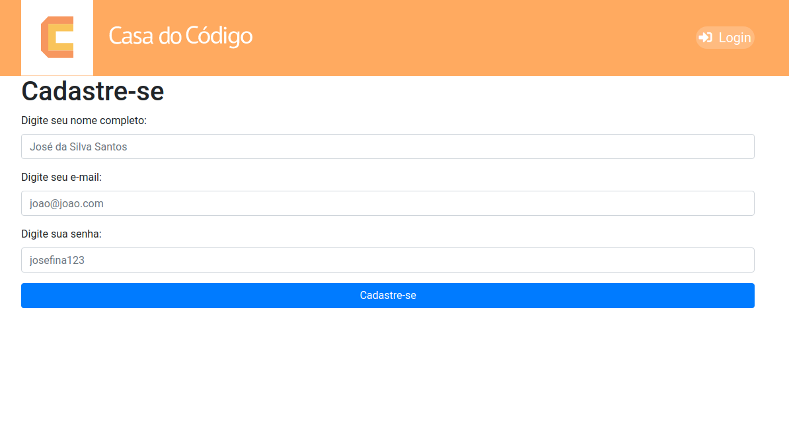
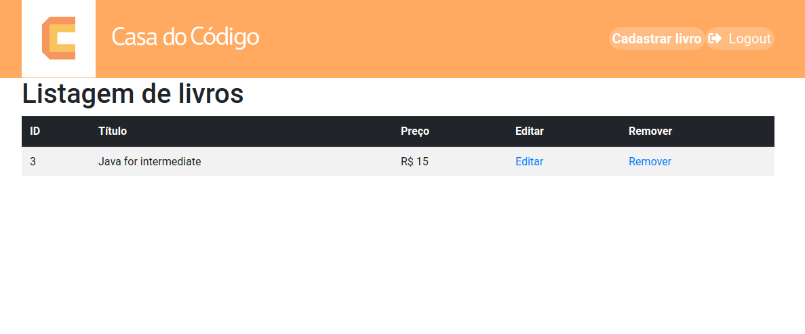
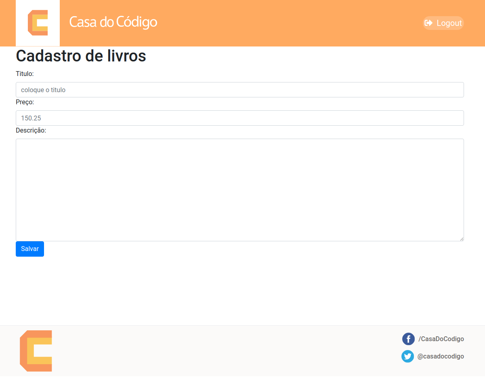

<h1>Node CRUD</h1>
</img>
</img>
</img>
</img>

# Sobre o projeto

Projeto final do curso de Node da Alura.
É um CRUD básico, usando Node e <a href="https://markojs.com/">Marko.js</a>.
Estamos usando <a href="https://www.sqlitetutorial.net/sqlite-nodejs/">Sqlite3</a> como banco de dados.
Instrutor : <a href="https://github.com/gabrielleite">Gabriel Leite</a>

# Rodando o projeto

Abra a pasta do projeto em sua cmd e digite ```` npm install ````.
Entre dentro da pasta src e digite ```` npm start ````, isso irá inicializar
a aplicação na porta :3001. 

O nodemon ficará observando mudanças, então basta recarregar a aplicação que as mudanças serão aplicadas.

Além disso, o nodemon não consegue ''observar'' os arquivos marko, então, feita alguma mudança neles, vá em qualquer arquivo javascript e recarregue a aplicação, só assim as mudanças serão aplicadas.

# Observações

Não vou upar o arquivo do banco de dados com o projeto. Após baixar e rodar pela primeira vez, o arquivo **data.db** será criado na pasta principal, contendo os registros do banco. 

Lembre-se, no arquivo **database.js** estão contidas as configurações do banco, e lá está rodando o serialize do sqlite, tudo dentro dessa função é rodado sempre que a a aplicação recarregar, logo, caso você exclua o livro ou o usuário que já vem cadastrados por padrão, ao atualizar a aplicação, os mesmos serão cadastrados novamente. Para evitar este comportamento, comente a função ou a exclua, mas deixe a função rodar pelo menos uma vez para as tabelas serem criadas.

Para mais detalhes, acesse a documentação do sqlite.

# Modificações

Alterei bastante da aplicação desenvolvida no curso, sendo a principal diferença a organização dos arquivos, e a implementação de um sistema de controle de livros por usuário.
Há uma página de cadastro de usuário, e cada usuário terá um controle dos seus livros, não existe uma rota principal com acesso a todos os livros.